# Email Agent

An AI-powered email assistant that reads your Gmail inbox, categorises messages, suggests quick actions, drafts replies in your writing style, and manages meetings — all from a single Streamlit dashboard.

## Features

- **Smart categorisation** — Emails are automatically labelled (important, newsletter, academic, social, etc.). Create your own custom labels and the agent learns from your overrides.
- **Quick actions** — Each email gets context-aware action buttons: reply options (orange), todo tasks (purple), and custom actions (grey).
- **Style-matched drafting** — The drafting pipeline (plan → draft → critique → revise → finalise) writes replies that match your personal tone and greeting style.
- **Meeting detection & scheduling** — Meeting invitations are detected automatically. Accept, decline, or reschedule with one click — the agent checks your Google Calendar for free slots and adds a Zoom link.
- **Todo list** — Actionable tasks extracted from emails are tracked in a built-in todo panel.
- **Memory & context** — Past interactions, sender history, and thread context feed into every decision for smarter suggestions over time.
- **Multi-model support** — Run fully offline with a local Qwen 2.5 3B model (default), upgrade to a local 7B model, or use Groq's hosted API for maximum speed.

## Architecture

The agent is built on **LangGraph** with three core graphs:

### 1. Email Processing Pipeline

Parallel fan-out: categorise, summarise, extract entities, detect urgency, and detect meetings all run simultaneously, then merge.

<p align="center">
  
</p>

### 2. Quick Actions Graph

Parallel fan-out: reply analysis and todo extraction run simultaneously, then merge/deduplicate/validate.

<p align="center">
  
</p>

### 3. Drafting Graph

Sequential: plan → draft → critique → (revise if needed) → finalise with signature.

<p align="center">
  
</p>

---

## Setup

### 1. Clone and install

```bash
git clone https://github.com/gnn9245/email-agent.git
cd email-agent
python -m venv .venv
source .venv/bin/activate   # Windows: .venv\Scripts\activate
pip install -r requirements.txt
```

### 2. Download the local model

The default model is **Qwen 2.5 3B Instruct** (GGUF, ~2 GB). Place it in the `models/qwen/` directory:

```bash
mkdir -p models/qwen
```

**Option A — Direct download link:**

Download [`qwen2.5-3b-instruct-q5_k_m.gguf`](https://huggingface.co/Qwen/Qwen2.5-3B-Instruct-GGUF/resolve/main/qwen2.5-3b-instruct-q5_k_m.gguf) and place it at `models/qwen/qwen2.5-3b-instruct-q5_k_m.gguf`.

**Option B — Hugging Face CLI:**

```bash
pip install huggingface_hub
huggingface-cli download Qwen/Qwen2.5-3B-Instruct-GGUF qwen2.5-3b-instruct-q5_k_m.gguf --local-dir models/qwen
```

**Option C — Receive the file directly:**

The `.gguf` model file is openly licensed and can be freely shared. If a teammate already has it, just copy it into `models/qwen/`.

### 3. Google API credentials

The app needs access to your Gmail and Google Calendar. You need a `credentials.json` OAuth 2.0 client file.

**If you received `credentials.json` with the project** (e.g. from a teammate), place it in the project root and skip to step 4. You may need to be added as a test user on the Google Cloud project — ask the project owner to add your Google account under **OAuth consent screen → Test users**.

**If you need to create your own:**

1. Go to the [Google Cloud Console](https://console.cloud.google.com/).
2. Create a new project (or select an existing one).
3. Enable the **Gmail API** and the **Google Calendar API**.
4. Go to **Credentials → Create Credentials → OAuth 2.0 Client ID**.
   - Application type: **Desktop app**.
   - Download the JSON file and save it as `credentials.json` in the project root.
5. Under **OAuth consent screen**, add your Google account as a test user.

### 4. Zoom credentials

Zoom integration is required for automatic meeting link creation.

1. Go to the [Zoom App Marketplace](https://marketplace.zoom.us/) and sign in.
2. Click **Develop → Build App → Server-to-Server OAuth**.
3. Note the **Account ID**, **Client ID**, and **Client Secret**.
4. Under **Scopes**, add `meeting:write:admin` (or `meeting:write`).
5. Activate the app.

### 5. Environment variables

```bash
cp .env.example .env
```

Edit `.env` and fill in your Zoom credentials:

```
ZOOM_ACCOUNT_ID=your_account_id
ZOOM_CLIENT_ID=your_client_id
ZOOM_CLIENT_SECRET=your_client_secret
```

The defaults use the local Qwen 3B model — no additional API keys needed.

### 6. Run

```bash
streamlit run app.py
```

On first launch the app opens a browser window to sign in with Google (OAuth). After authorising, the agent fetches your inbox and processes it automatically.

---

## Optional: Qwen 2.5 7B model

For better quality on complex emails, download the 7B model (~4.6 GB, split into two files):

Download both split files from [Qwen2.5-7B-Instruct-GGUF](https://huggingface.co/Qwen/Qwen2.5-7B-Instruct-GGUF):

- `qwen2.5-7b-instruct-q4_k_m-00001-of-00002.gguf`
- `qwen2.5-7b-instruct-q4_k_m-00002-of-00002.gguf`

Place both in `models/qwen/` and select **Qwen 2.5 7B (local)** from the model dropdown in the UI.

---

## Optional: Groq (hosted API)

For faster inference using hosted models instead of local ones:

1. Get a free API key at [https://console.groq.com/](https://console.groq.com/).
2. In `.env`:
   ```
   LLM_PROVIDER=groq
   GROQ_API_KEY=gsk_your_key_here
   ```
3. Select **Groq (hosted)** from the model dropdown.

Groq uses `llama-3.3-70b-versatile` for heavy tasks and `llama-3.1-8b-instant` for lightweight tasks by default.

---

## Summary: what do you need?

| Component                         | Required? | Notes                                         |
| --------------------------------- | --------- | --------------------------------------------- |
| Python 3.11+                      | **Yes**   |                                               |
| `pip install -r requirements.txt` | **Yes**   |                                               |
| Qwen 2.5 3B GGUF model            | **Yes**   | ~2 GB download (see step 2)                   |
| `credentials.json` (Google OAuth) | **Yes**   | Create your own or get from the project owner |
| Zoom credentials                  | **Yes**   | Server-to-Server OAuth app (see step 4)       |
| Groq API key                      | No        | Optional alternative to local model           |

---

## Project structure

```
app.py                      # Streamlit UI (entry point)
config.py                   # LLM configuration and task profiles
agent/
  langgraph_pipeline.py     # Main email processing graph (parallel)
  quick_actions_graph.py    # Quick action suggestion graph (parallel)
  drafting_graph.py         # Reply drafting graph (plan→draft→critique→finalise)
  categorizer.py            # Email categorisation (heuristics + LLM)
  summarizer.py             # Email summarisation
  meeting_extractor.py      # Meeting/event detection
  urgent_detector.py        # Urgency detection (keyword-based)
  decision_suggester.py     # Legacy decision suggester
  drafter.py                # Core reply drafting
  style_learner.py          # Writing style analysis
  profile.py                # User profile loader
  email_memory.py           # SQLite storage, todos, labels, sender history
  memory_store.py           # Email archive/memory helpers
  llm.py                    # LLM provider abstraction (local + Groq)
  text_cleaner.py           # HTML/email body cleaning
  scheduling.py             # Calendar slot finder
  scheduling_graph.py       # Scheduling graph
  delegation.py             # Task delegation helpers
tools/
  gmail_tools.py            # Gmail API wrapper (fetch, send, archive)
  calendar_tools.py         # Google Calendar API wrapper
  google_auth.py            # OAuth 2.0 authentication flow
  zoom_tools.py             # Zoom meeting creation
data/                       # Auto-generated at runtime (gitignored)
models/
  qwen/                     # Local GGUF model files (gitignored)
```

## Tests

```bash
python -m pytest tests/ -v
```
